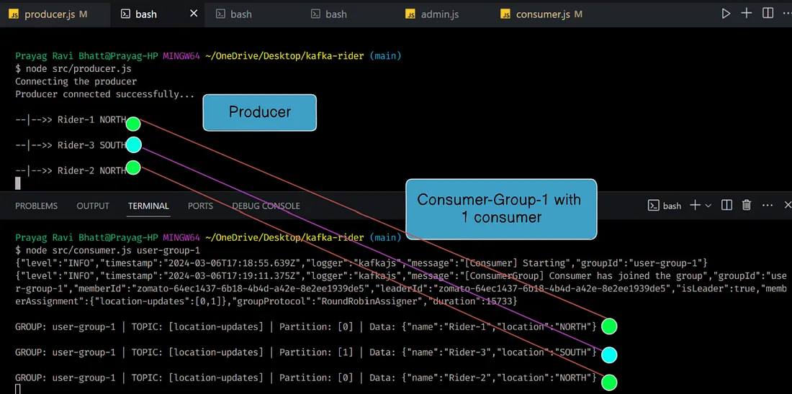
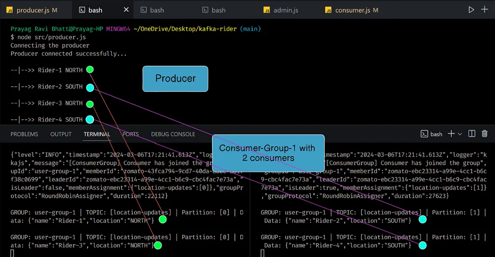
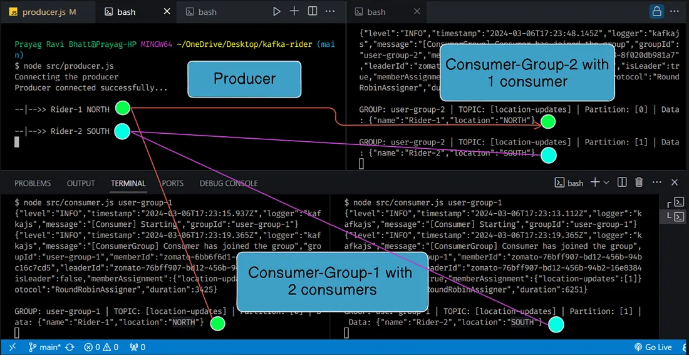

# Kafka Rider: Real-Time Distributed Delivery Service
## Check out my [Medium Blog Post](https://medium.com/your-username/your-blog-post-title) 📚

## Introduction
- Kafka Rider is a real-time distributed delivery service built on top of Apache Kafka.
- It provides a scalable and fault-tolerant solution for handling location updates of delivery riders in real-time.

## Installation
### Prerequisites
- Node.js installed on your system
- Apache Kafka installed and running

### Steps
1. **Clone the Kafka Rider repository:**
   ```bash
   git clone https://github.com/your-username/kafka-rider.git
   ```

2. Navigate to the project directory:
   ```makefile
     cd kafka-rider
   ```

3. Install dependencies:
   ```makefile
     npm install
   ``` 

4. Create a .env file based on the provided .env.sample and replace <YOUR_PRIVATE_IP_ADDRESS> with your private IP address.
   ```env
     PRIVATE_IP=<YOUR_PRIVATE_IP_ADDRESS>
     KAFKA_PORT=9092
   ```

- Usage
  Run the admin script to create the Kafka topic:
   ```bash
       node admin.js
   ```

  # Kafka Setup Guide

  ## Run the Zookeeper Service
  
  To run the Zookeeper service, follow these steps:
  
  1. Fire up Docker Desktop.
  2. Open Terminal, Command Prompt, or your preferred shell.
  3. Run the following command:
  
       ```bash
         docker run -p 2181:2181 zookeeper
       ```
  
  ## Running Kafka Service
  
  To run the Kafka service, follow these steps:
  
  1. Find the private IP of your device (you can find it inside your WiFi settings).
  2. Open a new terminal.
  3. Run the following command:
  
      ```bash
      docker run -p 9092:9092 \
      -e KAFKA_ZOOKEEPER_CONNECT=<YOUR_PRIVATE_IP>:2181 \
      -e KAFKA_ADVERTISED_LISTENERS=PLAINTEXT://<YOUR_PRIVATE_IP>:9092 \
      -e KAFKA_OFFSETS_TOPIC_REPLICATION_FACTOR=1 \
      confluentinc/cp-kafka
      ```

  ## Running a Consumer Group with a Single Consumer
  
  To run a consumer group with a single consumer, follow these steps:
  
  1. Open another terminal.
  2. Run the following command:
  
      ```bash
      node src/consumer.js usergroup-1
      ```
      

  
  ## Running Two Consumer Groups
  
  To run two consumer groups, follow these steps:
  
  1. Open one more terminal.
  2. Run the following command:
  
      ```bash
      node src/consumer.js usergroup-2
      ```
      
  
  ## Auto-Balancing
     Auto-balancing is a feature of Kafka consumer groups that ensures an even distribution of partitions among the consumers within 
     the group. When a new consumer joins a consumer group or an existing consumer leaves the group, Kafka automatically reassigns
     partitions among the remaining consumers to maintain a balanced workload.
     

  
